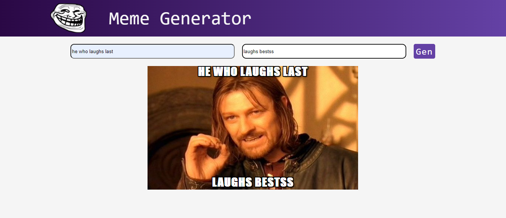

# Meme-Generator-App 

## Table of contents

- [Overview](#overview)
  - [The challenge](#the-challenge)
  - [Screenshot](#screenshot)
  - [Links](#links)
- [My process](#my-process)
  - [Built with](#built-with)
  - [What I learned](#what-i-learned)
  - [Useful resources](#useful-resources)
- [Author](#author)

## Overview

### The challenge

Users should be able to:

- View the optimal layout for the site depending on their device's screen size
- Add a text
- Generate a rendom image

### Screenshot




### Links

- Solution URL: (https://github.com/faozziyyah/meme-generator)
- Live Site URL: (https://memegenerator-react-app.netlify.app/)

## My process

### Built with

- CSS custom properties
- Flexbox
- [React](https://reactjs.org/) - React: JS library
- API

### What I learned

- How to fetch data from an APIin React
- React state and hooks

```React.js
class MemeGenerator extends Component {
    constructor() {
        super()
        this.state = {
            topText: "",
            bottomText: "",
            randomImg: "http://i.imgflip.com/1bij.jpg",
            allMemeImgs: []
        }
        this.handleChange = this.handleChange.bind(this)
        this.handleSubmit = this.handleSubmit.bind(this)
    }
```

### Useful resources

- [Scrimba](https://scrimba.com/learn/learnreact) - React Tutorial

## Author

- Linkedin - [omowunmi daud](https://linkedin.com/in/faasamomowunmi-daud)
- Twitter - [@muslimahdev](https://www.twitter.com/muslimahdev)
